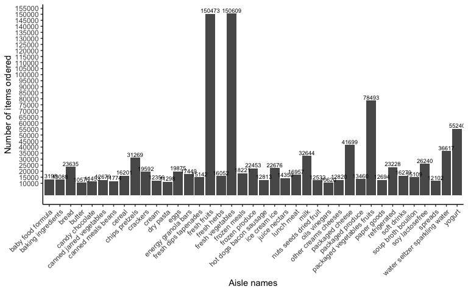
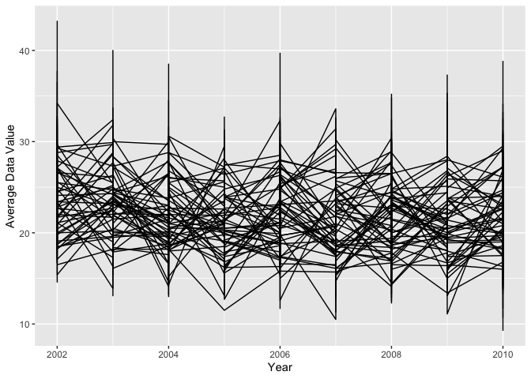

p8105\_hw3\_cx2227
================
Chuyue Xiang
10/10/2019

## Problem 1

``` r
library(p8105.datasets)
data("instacart")

str(instacart)
```

### Short description

  - The `instacart` dataset has 1384617 observations and 15 variables.
  - There are 4 character variables and 11 numeric variables.
  - This dataset contains data of various products.
  - Some of the key variables are order\_id, product\_id, aisle\_id, and
    days\_since\_prior\_order.
  - For example, Bulgarian Yogurt with prouct id 49302 has been
    reordered once 9 days since the prior
order.

### Part 1: How many aisles are there, and which aisles are the most items ordered from?

``` r
instacart %>% 
  group_by(aisle) %>% 
  summarize(n_obs = n()) %>%
  arrange(desc(n_obs)) 
```

  - There are 134 aisles.
  - The “fresh vegetables” aisle has the most
items.

### Part 2: Make a plot that shows the number of items ordered in each aisle, limiting this to aisles with more than 10000 items ordered. Arrange aisles sensibly, and organize your plot so others can read it.

``` r
instacart %>% 
  group_by(aisle) %>% 
  summarize(n_obs = n()) %>% 
  filter(n_obs > 10000) %>% 
  arrange(aisle) %>% 
  
  ggplot(aes(x = aisle, y = n_obs)) + geom_bar(stat = "identity") +
  theme_classic() +
  theme(axis.text.x = element_text(angle = 45, hjust = 1)) + 
  scale_y_continuous(breaks = seq(10000,160000,5000)) + 
  labs(x = "Aisle names", y = "Number of items ordered") +
  geom_text(aes(label=n_obs), vjust=-0.3, size=2.5)
```

<!-- -->

  - The number if items ordered from aisle “fresh fruits” and “fresh
    vegetables” are way more than others, followed by “packaged
    vegetables fruits” and
“yogurt”.

### Part 3: Make a table showing the three most popular items in each of the aisles “baking ingredients”, “dog food care”, and “packaged vegetables fruits”. Include the number of times each item is ordered in your table.

``` r
instacart %>% 
  filter(aisle %in% c("baking ingredients", "dog food care", "packaged vegetables fruits")) %>% 
  group_by(aisle, product_name) %>% 
  summarize(tot_order = sum(order_number)) %>% 
  mutate(ord_ranking = min_rank(desc(tot_order))) %>% 
  filter(ord_ranking %in% c(1,2,3)) %>% 
  arrange(aisle, ord_ranking) %>% 
  knitr::kable()
```

| aisle                      | product\_name                                 | tot\_order | ord\_ranking |
| :------------------------- | :-------------------------------------------- | ---------: | -----------: |
| baking ingredients         | Light Brown Sugar                             |       8605 |            1 |
| baking ingredients         | Cane Sugar                                    |       6244 |            2 |
| baking ingredients         | Organic Vanilla Extract                       |       6003 |            3 |
| dog food care              | Standard Size Pet Waste bags                  |        675 |            1 |
| dog food care              | Beef Stew Canned Dog Food                     |        631 |            2 |
| dog food care              | Snack Sticks Chicken & Rice Recipe Dog Treats |        589 |            3 |
| packaged vegetables fruits | Organic Baby Spinach                          |     171301 |            1 |
| packaged vegetables fruits | Organic Raspberries                           |     113932 |            2 |
| packaged vegetables fruits | Organic Blueberries                           |      86765 |            3 |

  - The most popular item in baking ingredients are Light Brown sugar,
    Cane sugar, and Organix Vanilla Extract.
  - The most popular item in dog food care are standard size pet waste
    bags, beef stew canned dog foo, and snack sticks Chicken & Rice
    Recipe Dog Treats.
  - The most popular item in packagedd vegetables fruits are organic
    baby spinach, organix raspberries, and organix
blueberries.

### Part 4: Make a table showing the mean hour of the day at which Pink Lady Apples and Coffee Ice Cream are ordered on each day of the week; format this table for human readers (i.e. produce a 2 x 7 table).

``` r
instacart %>% 
  filter(product_name %in% c("Pink Lady Apples", "Coffee Ice Cream")) %>% 
  group_by(product_name, order_dow) %>% 
  summarize(mean_order_hour_of_day = mean(order_hour_of_day)) %>% 
  pivot_wider(names_from = order_dow, values_from = mean_order_hour_of_day) %>% 
  knitr::kable()
```

| product\_name    |        0 |        1 |        2 |        3 |        4 |        5 |        6 |
| :--------------- | -------: | -------: | -------: | -------: | -------: | -------: | -------: |
| Coffee Ice Cream | 13.77419 | 14.31579 | 15.38095 | 15.31818 | 15.21739 | 12.26316 | 13.83333 |
| Pink Lady Apples | 13.44118 | 11.36000 | 11.70213 | 14.25000 | 11.55172 | 12.78431 | 11.93750 |

  - Purchases are mainly occured on afternoons for both products.

## Problem 2

``` r
library(p8105.datasets)
data("brfss_smart2010")
```

### Part 1: Data cleaning

``` r
brfss_smart2010 = brfss_smart2010 %>% 
  janitor::clean_names() %>% 
  filter(topic == "Overall Health", response %in% c("Excellent", "Very good", "Good", "Fair","Poor")) %>%   
  mutate(response = fct_relevel(response, "Poor", "Fair", "Good", "Very good","Excellent")) 

brfss_smart2010
```

    ## # A tibble: 10,625 x 23
    ##     year locationabbr locationdesc class topic question response
    ##    <int> <chr>        <chr>        <chr> <chr> <chr>    <fct>   
    ##  1  2010 AL           AL - Jeffer… Heal… Over… How is … Excelle…
    ##  2  2010 AL           AL - Jeffer… Heal… Over… How is … Very go…
    ##  3  2010 AL           AL - Jeffer… Heal… Over… How is … Good    
    ##  4  2010 AL           AL - Jeffer… Heal… Over… How is … Fair    
    ##  5  2010 AL           AL - Jeffer… Heal… Over… How is … Poor    
    ##  6  2010 AL           AL - Mobile… Heal… Over… How is … Excelle…
    ##  7  2010 AL           AL - Mobile… Heal… Over… How is … Very go…
    ##  8  2010 AL           AL - Mobile… Heal… Over… How is … Good    
    ##  9  2010 AL           AL - Mobile… Heal… Over… How is … Fair    
    ## 10  2010 AL           AL - Mobile… Heal… Over… How is … Poor    
    ## # … with 10,615 more rows, and 16 more variables: sample_size <int>,
    ## #   data_value <dbl>, confidence_limit_low <dbl>,
    ## #   confidence_limit_high <dbl>, display_order <int>,
    ## #   data_value_unit <chr>, data_value_type <chr>,
    ## #   data_value_footnote_symbol <chr>, data_value_footnote <chr>,
    ## #   data_source <chr>, class_id <chr>, topic_id <chr>, location_id <chr>,
    ## #   question_id <chr>, respid <chr>, geo_location <chr>

### Part 2: In 2002, which states were observed at 7 or more locations? What about in 2010?

``` r
brfss_smart2010 %>% 
  filter(year == 2002) %>% 
  group_by(locationabbr, locationdesc) %>% 
  summarize(n_obs = n()) %>% 
  group_by(locationabbr) %>% 
  summarize(n_obs = n()) %>% 
  filter(n_obs >= 7)
```

    ## # A tibble: 6 x 2
    ##   locationabbr n_obs
    ##   <chr>        <int>
    ## 1 CT               7
    ## 2 FL               7
    ## 3 MA               8
    ## 4 NC               7
    ## 5 NJ               8
    ## 6 PA              10

``` r
brfss_smart2010 %>% 
  filter(year == 2010) %>% 
  group_by(locationabbr, locationdesc) %>% 
  summarize(n_obs = n()) %>% 
  group_by(locationabbr) %>% 
  summarize(n_obs = n()) %>% 
  filter(n_obs >= 7)
```

    ## # A tibble: 14 x 2
    ##    locationabbr n_obs
    ##    <chr>        <int>
    ##  1 CA              12
    ##  2 CO               7
    ##  3 FL              41
    ##  4 MA               9
    ##  5 MD              12
    ##  6 NC              12
    ##  7 NE              10
    ##  8 NJ              19
    ##  9 NY               9
    ## 10 OH               8
    ## 11 PA               7
    ## 12 SC               7
    ## 13 TX              16
    ## 14 WA              10

  - In 2002, CT, FL, MA, NC, HJ, PA were observed at 7 or more
    locations.
  - In 2010, CA, CO, FFL, MA, MD, NC, NE, NJ, NY, OH, PA, SC, TX, WA
    were observed at 7 or mroe
locations.

### Part 3: Construct a dataset that is limited to Excellent responses, and contains, year, state, and a variable that averages the data\_value across locations within a state. Make a “spaghetti” plot of this average value over time within a state

``` r
brfss_smart2010 %>% 
  filter(response == "Excellent") %>% 
  group_by(year, locationabbr, locationdesc) %>% 
  summarize(avg_data_value = mean(data_value)) %>% 
  select(year, locationabbr, locationdesc, avg_data_value) %>% 
  ggplot(aes(x = year, y = avg_data_value)) + 
   geom_line(aes(group = locationabbr)) + 
   labs(x = "Year", y = "Average Data Value") 
```

<!-- -->

  - a spaghetti plot might not be the best choice in this situation
